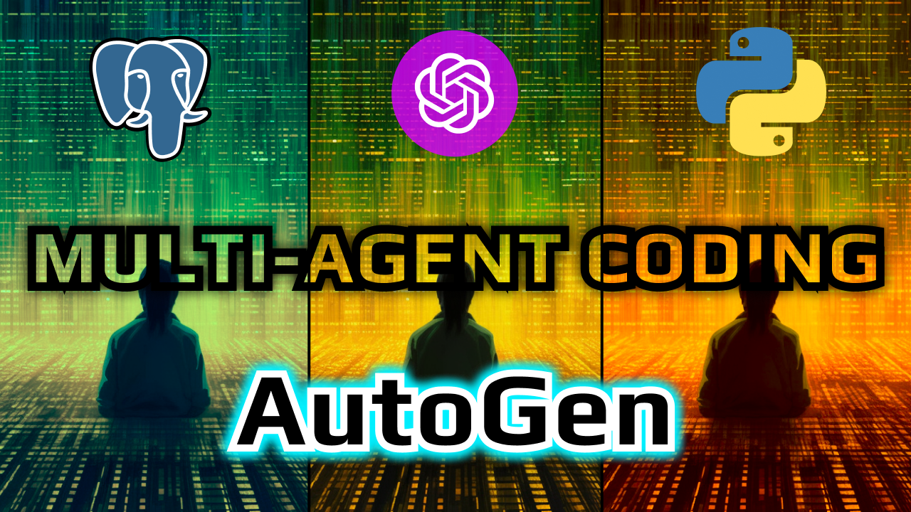
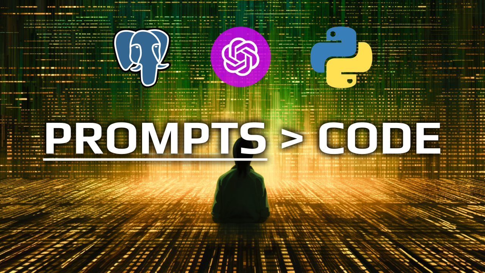
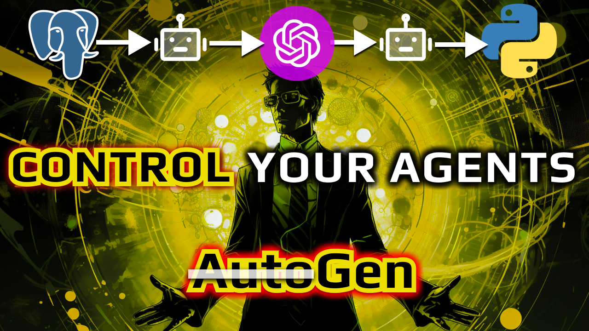
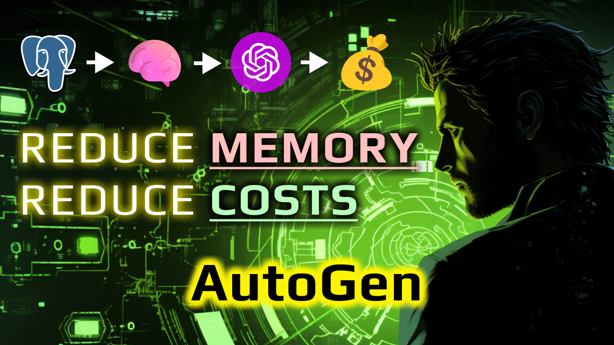
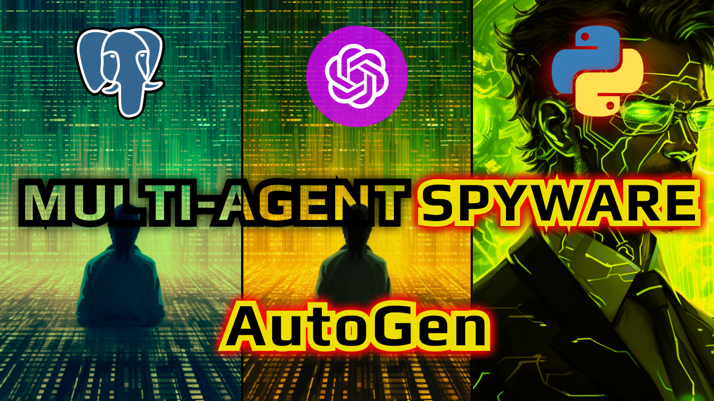
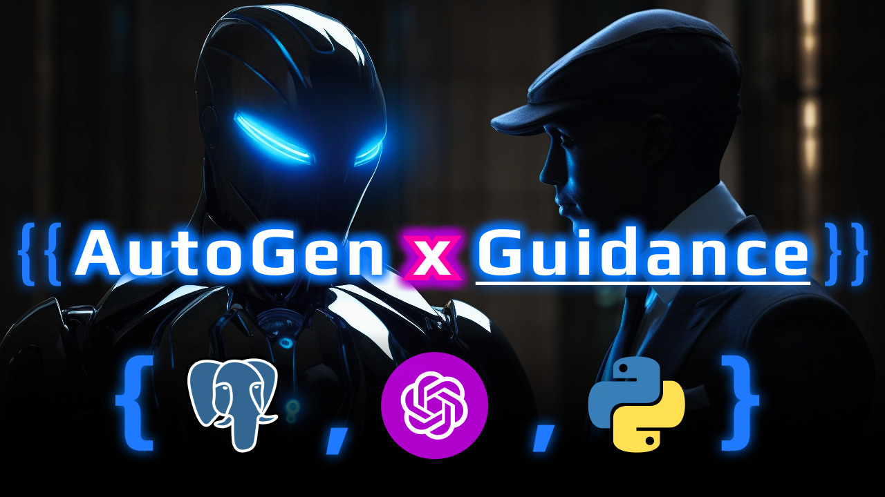

# Multi-Agent Postgres Data Analytics
*The way we interact with our data is changing.*

# 💬 Read This First 💬
> This repo is an **_experiment_** and **_learning tool_** for building multi-agent systems.
>
> It is **ONE** of **MANY** steps toward building fully autonomous, Agentic software.
> 
> It is **NOT** a framework, or library, or shortcut. 
> 
> It **IS** a **_stepping stone_** to help you internalize concepts, patterns and building blocks for your own multi-agent systems and applications.
>
> Code only tells a story at a moment in time. I highly recommend you watch the [video series](https://www.youtube.com/playlist?list=PLS_o2ayVCKvDzj2YxeFqMq9UbR1PkPEh0) to see the **how and the why** behind the structure of this experimental codebase.
> 
> In the series we build this from scratch and dive deep into complexities, principles, patterns and ideas surrounding multi-agent software. The video order is linked below, mapping branches to videos.
>
> This repo will not be maintained or updated beyond the lifespan of the series. It is a snapshot in time of the code we built in the video series and is meant only to be a reference for you on your journey to building your own multi-agent systems, **_nothing more_**.

## 💻 Multi-Agent Postgres Data Analytics Tool 💻
This is a multi-agent system that allows you to ask questions about your postgres database in natural language.

The codebase is powered by GPT-4, AutoGen, Postgres, and Guidance.

It's the first of many multi-agent applications that utilize LLMs (large language models) to enable reasoning and decision making with reduced need for explicit rules or logic.

## 🔵 Multi-Agent Patterns & Terminology 🔵
Throughout the codebase we built up several existing and new patterns and terminology you've likely seen in some shape or form. Here's a quick overview of the most important ones.
- **Agent** - An agent is LLM powered tool with a single purpose that can be assigned a function and/or prompt.
- **Multi-Agent Team** - A collection of agents that exchange messages and work together to accomplish a goal.
- **Conversations** - The exchange of messages between a multi-agent team.
- **Conversation Flows** - The way agents communicate with each other. How you're agents communicate completely changes the way your application works. The conversation flow dictates which agent speaks, the order in which they speak, who they speak to and what they say.
- **Orchestrator** - Manages a single agent team, their conversations and their output. Orchestrators contain different types of conversation flows.
- **Instruments** - Instruments are the tools agents can use. Think of it like a front-end store. It contains state and functions that both agents and orchestrators can utilize throughout the lifecycle of the application. Agents and Orchestrators can consume and manipulate the state of instruments although typically, only agents update state.
- **Decision Agents** - Agents that respond with concrete decisions which can dictate the flow of your applications. To build complex agentic systems you need agents to have the ability to make concrete decisions that then drive the flow of your application.
- **Structured vs Unstructured Agents** - Structured agents are agents that respond with structured data. Unstructured agents are agents that respond with unstructured data. Structured agents are typically decision agents.

## 💻 Setup 💻
- `poetry install`
- `cp .env.example .env`
- Fill out `.env` with your postgres url and openai api key
- Run a prompt against your database
  - `poetry run start --prompt "<ask your agent a question about your postgres database>"`
    - Start with something simple to get a feel for it and then build up to more complex questions.

## 📺 Video Series - Learn By Watching 📺

### [Part 1 - Prompt Engineering an ENTIRE codebase: Postgres Data Analytics Al Agent](https://youtu.be/jmDMusirPKA)
Branch: [v1-prompt-engineering-an-entire-codebase](https://github.com/disler/multi-agent-postgres-data-analytics/tree/v1-prompt-engineering-an-entire-codebase)

### [Part 2 - One Prompt is NOT enough: Using AutoGen to code a Multi-Agent Postgres AI Tool](https://youtu.be/JjVvYDPVrAQ)
Branch: [v2-using-autogen-to-build-our-multi-agent-tool](https://github.com/disler/multi-agent-postgres-data-analytics/tree/v2-using-autogen-to-build-our-multi-agent-tool)

### [Part 3 - Make AutoGen Consistent: CONTROL your LLM agents for ACCURATE Postgres Al Data Analytics](https://youtu.be/4o8tymMQ5GM)
Branch: [v3-make-autogen-consistent-control-your-llm](https://github.com/disler/multi-agent-postgres-data-analytics/tree/v3-make-autogen-consistent-control-your-llm)

### [Part 4 - AutoGen Token Tactics: FIRING AI Agents, USELESS Vector Embeddings, GPT-4 Memory Tricks](https://youtu.be/CKo-czvxFkY)
Branch: [v4-autogen-token-tactics-firing-ai-agents](https://github.com/disler/multi-agent-postgres-data-analytics/tree/v4-autogen-token-tactics-firing-ai-agents)

### [Part 5 - AutoGen SPYWARE: Coding Systems for SUCCESSFUL AI Agents (Postgres Data Analytics)](https://youtu.be/UA6IVMDPuC8)
Branch: [v5-autogen-spyware-coding-systems-for-successful-ai](https://github.com/disler/multi-agent-postgres-data-analytics/tree/v5-autogen-spyware-coding-systems-for-successful-ai)

### [Part 6 - Using AUTOGEN & GUIDANCE to code LLM Control Flow & JSON Agents (No Prompt Engineering)](https://youtu.be/XGCWyfA3rgQ)
Branch: `v6-control-flow-and-structured-response`

---

# 🧠 Major Learnings 🧠

## 💡 Why are multi-agent applications important?
- They're important because they allows us to create a more accurate model of the world.
- We become orchestrators enabling less engineering level and more product level work.
- They enable reasoning and decision making in a way that is more human like than ever before.

## ✅ Pros
- Can assign functions & prompts to specific agents, enabling specialization yielding better results.
- Agents can reflect on results to provide feedback thus improving the results.
- Can role play real organizational structures, existing and new.

## ❌ Cons
- It's an art to get the roles right. How many do you need? What are they? How do you know?
- Can get expensive in testing and scales with # of agents. The more agents the more expensive each query is.
- Can be difficult to debug why a multi-agent system is not working as expected due to the non-deterministic nature of LLMs.