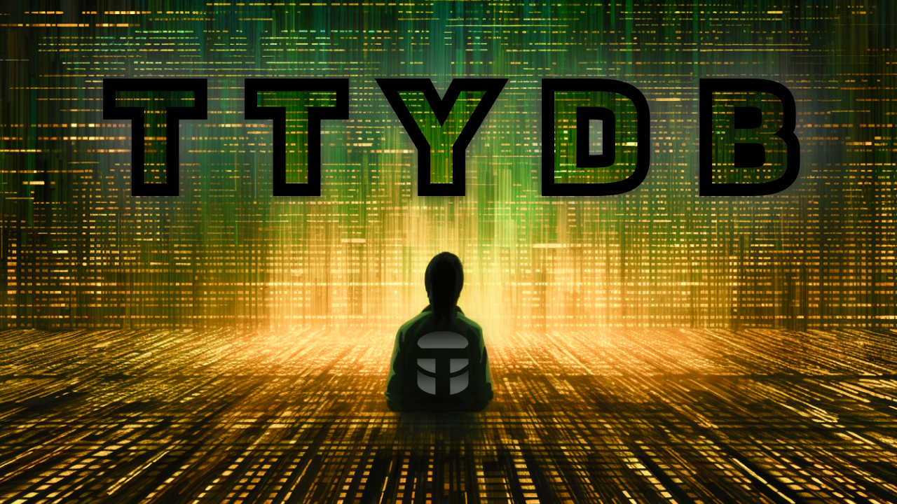

# Multi-Agent Postgres Data Analytics
*The way we interact with our data is changing.*

# 💬 Read This First 💬
> This repo is an **_experiment_** and **_learning tool_** for building multi-agent systems.
>
> It is **ONE** of **MANY** steps toward building fully autonomous, _agentic software_.
> 
> It is **NOT** a framework, or library, or shortcut. 
> 
> It **IS** a **_stepping stone_** to help you internalize concepts, patterns and building blocks for your own multi-agent systems and applications.
>
> Code only tells a story at a moment in time. I highly recommend you watch the [video series](https://www.youtube.com/playlist?list=PLS_o2ayVCKvDzj2YxeFqMq9UbR1PkPEh0) to see the **how and the why** behind the structure of this experimental codebase.
> 
> In the series we build this from scratch and dive deep into complexities, principles, patterns and ideas surrounding multi-agent software. The video order is linked below, mapping branches to videos.
>
> This repo will not be maintained or updated beyond the lifespan of the series. It is a snapshot in time of the code we built in the video series and is meant only to be a reference for you on your journey to building your own multi-agent systems, **_nothing more_**.
>
> When we complete the series will we freeze the codebase. We will then use it as a reference for experiments, products, and videos.

## 💻 Multi-Agent Postgres Data Analytics Tool 💻
This is a multi-agent system that allows you to ask questions about your postgres database in natural language.

The codebase is powered by GPT-4, Assistance API, AutoGen, Postgres, and Guidance.

It's the first of many multi-agent applications that utilize LLMs (large language models) to enable reasoning and decision making with reduced need for explicit rules or logic.

## 💻 Setup 💻
- **Read the codebase first**. Remember, this is an experiment and learning tool. It's not meant to be a framework or library.
- Run `git branch -a` to view all branches. Each branch is a video in the series.
  - `git checkout <branch-name>` you want to view.
- `poetry install`
- `cp .env.sample .env`
- Fill out `.env` with your postgres url and openai api key
- Run a prompt against your database
  - `poetry run start --prompt "<ask your agent a question about your postgres database>"`
    - Start with something simple to get a feel for it and then build up to more complex questions.

## 🛠️ Core Tech Stack 🛠️
- [OpenAI](https://openai.com/) - GPT-4, GPT-4 Turbo, Assistance API
- [AutoGen](https://microsoft.github.io/autogen/) - Multi-Agent Framework
- [Postgres](https://www.postgresql.org/) - Database
- [Guidance](https://github.com/guidance-ai/guidance) - Structured LLM Responses
- [Aider](https://aider.chat/) - AI Pair Programming
- [Poetry](https://python-poetry.org/) - Package Manager
- [Python ^3.10](https://www.python.org/downloads/release/python-3100/) - Programming Language

## 🔵 Multi-Agent Patterns & Terminology 🔵
Throughout the codebase we built up several existing and new patterns and terminology you've likely seen in some shape or form. Here's a quick overview of the most important ones.
- **Agent** - An agent is LLM powered tool with a single purpose that can be assigned a function and/or prompt.
- **Multi-Agent Team** - A collection of agents that exchange messages and work together to accomplish a goal.
- **Conversations** - The exchange of messages between a multi-agent team.
- **Conversation Flows** - The way agents communicate with each other. How you're agents communicate completely changes the way your application works. The conversation flow dictates which agent speaks, the order in which they speak, who they speak to and what they say.
- **Orchestrator** - Manages a single agent team, their conversations and their output. Orchestrators contain different types of conversation flows.
- **Instruments** - Instruments are the tools agents can use. Think of it like a front-end store. It contains state and functions that both agents and orchestrators can utilize throughout the lifecycle of the application. Agents and Orchestrators can consume and manipulate the state of instruments although typically, only agents update state.
- **Decision Agents** - Agents that respond with concrete decisions which can dictate the flow of your applications. To build complex agentic systems you need agents to have the ability to make concrete decisions that then drive the flow of your application.
- **Structured vs Unstructured Agents** - Structured agents are agents that respond with structured data. Unstructured agents are agents that respond with unstructured data. Structured agents are typically decision agents.

## 📺 Video Series - Learn By Watching 📺

### [Part 1 - Prompt Engineering an ENTIRE codebase: Postgres Data Analytics Al Agent](https://youtu.be/jmDMusirPKA)
Branch: [v1-prompt-engineering-an-entire-codebase](https://github.com/disler/multi-agent-postgres-data-analytics/tree/v1-prompt-engineering-an-entire-codebase)

Video: [https://youtu.be/jmDMusirPKA](https://youtu.be/jmDMusirPKA)

### [Part 2 - One Prompt is NOT enough: Using AutoGen to code a Multi-Agent Postgres AI Tool](https://youtu.be/JjVvYDPVrAQ)
Branch: [v2-using-autogen-to-build-our-multi-agent-tool](https://github.com/disler/multi-agent-postgres-data-analytics/tree/v2-using-autogen-to-build-our-multi-agent-tool)

Video: [https://youtu.be/JjVvYDPVrAQ](https://youtu.be/JjVvYDPVrAQ)

### [Part 3 - Make AutoGen Consistent: CONTROL your LLM agents for ACCURATE Postgres Al Data Analytics](https://youtu.be/4o8tymMQ5GM)
Branch: [v3-make-autogen-consistent-control-your-llm](https://github.com/disler/multi-agent-postgres-data-analytics/tree/v3-make-autogen-consistent-control-your-llm)

Video: [https://youtu.be/4o8tymMQ5GM](https://youtu.be/4o8tymMQ5GM)

### [Part 4 - AutoGen Token Tactics: FIRING AI Agents, USELESS Vector Embeddings, GPT-4 Memory Tricks](https://youtu.be/CKo-czvxFkY)
Branch: [v4-autogen-token-tactics-firing-ai-agents](https://github.com/disler/multi-agent-postgres-data-analytics/tree/v4-autogen-token-tactics-firing-ai-agents)

Video: [https://youtu.be/CKo-czvxFkY](https://youtu.be/CKo-czvxFkY)

### [Part 5 - AutoGen SPYWARE: Coding Systems for SUCCESSFUL AI Agents (Postgres Data Analytics)](https://youtu.be/UA6IVMDPuC8)
Branch: [v5-autogen-spyware-coding-systems-for-successful-ai](https://github.com/disler/multi-agent-postgres-data-analytics/tree/v5-autogen-spyware-coding-systems-for-successful-ai)

Video: [https://youtu.be/UA6IVMDPuC8](https://youtu.be/UA6IVMDPuC8)

### [Part 6 - Using AUTOGEN & GUIDANCE to code LLM Control Flow & JSON Agents (No Prompt Engineering)](https://youtu.be/XGCWyfA3rgQ)
Branch: [v6-control-flow-and-structured-response](https://github.com/disler/multi-agent-postgres-data-analytics/tree/v6-control-flow-and-structured-response)

Video: [https://youtu.be/XGCWyfA3rgQ](https://youtu.be/XGCWyfA3rgQ)

### [Part 7 - OpenAI Macro & Micro Strategy: Master Assistants API, Threads, Messages, and Runs](https://youtu.be/KwcrjP3vuy0)
Branch: [v7-turbo4-assistants-threads-messages](https://github.com/disler/multi-agent-postgres-data-analytics/tree/v7-turbo4-assistants-threads-messages)

Video: [https://youtu.be/KwcrjP3vuy0](https://youtu.be/KwcrjP3vuy0)

### [Part 8 - Copilot Prompt Engineering: 3 UI Frameworks, 2 AI Agents, 1 Coding Assistant (AIDER CCC)](https://youtu.be/7EA19-D4-Zo)

Branch: [v8-ccc-ai-engineering-with-aider](https://github.com/disler/multi-agent-postgres-data-analytics/tree/v8-ccc-ai-engineering-with-aider)

Video: [https://youtu.be/7EA19-D4-Zo](https://youtu.be/7EA19-D4-Zo)

### [Part 9 - Your AI Agents can SELF-CORRECT: Using Assistants API to AUTO FIX SQL Database Errors](https://youtu.be/Uf7cYAXe3eI)

Branch: [v9-self-correcting-assistant](https://github.com/disler/multi-agent-postgres-data-analytics/tree/v9-self-correcting-assistant)

Video: [https://youtu.be/Uf7cYAXe3eI](https://youtu.be/Uf7cYAXe3eI)

### [Part 10 - Talk To Your Database - A GPT Multi Agent Postgres Data Analytics Tool](https://youtu.be/5wROK4lBoeo)

Branch: [v10-talk-to-your-database-beta-launch](https://github.com/disler/multi-agent-postgres-data-analytics/tree/v10-talk-to-your-database-beta-launch)

Video: [https://youtu.be/5wROK4lBoeo](https://youtu.be/5wROK4lBoeo)

Talk To Your Database: [https://talktoyourdb.com](https://talktoyourdatabase.com)

---

# 🧠 Major Learnings Throughout the Series 🧠

## 💡 Why are multi-agent applications important?
- They're important because they allows us to create a more accurate model of the world.
- We become orchestrators enabling less engineering level and more product level work.
- They enable reasoning and decision making in a way that is more human like than ever before.
- We can build systems that make decisions as we would while operating alongside us.
- We can solve problems that previously required a dedicated hire or an entire team to solve.

## ✅ Multi-Agent Systems: The Good
- Can assign functions & prompts to specific agents, enabling specialization yielding better results.
- Agents can reflect on results to provide feedback thus improving the results.
- Can role play real organizational structures, existing and new.
- Ecosystem is evolving rapidly. New tools and frameworks are being built every day.
- Upside potential is ridiculously massive. We're talking asymmetric ROI, max [leverage](https://www.navalmanack.com/almanack-of-naval-ravikant/find-a-position-of-leverage), [superlinear](http://www.paulgraham.com/superlinear.html) upside. The more agentic build blocks you have the more powerful your engineering and product potential becomes.
- Multi-agent engineering is probably the most important thing happening in software right now (2023-2024).
- The road to agentic software is clear. Solve small problems, create reusable building blocks, and then combine them to solve bigger problems.
- GPT-4 can support multi-agent systems without a doubt. It is the best model by light-years and drives incredible reasoning readily available at your fingertips.

## ❌ Multi-Agent Systems: The Bad
- It's an art to get the roles and the function of your agent right. How many do you need? What are they? How do you know?
- Can get expensive in testing and scales with # of agents. The more agents the more expensive each query is.
- Can be difficult to debug why a multi-agent system is not working as expected due to the non-deterministic nature of LLMs.
- Memory management is a major issue. The context window is forcing a lot of weird, intricate code to manage memory.
- Too much noise and hype in the AI Agent ecosystem. Lot's of clickbait hype with little follow through value. Hard to find good resources.
- Very few are engineers are publicly building multi-agent systems. Most are toy examples or ripping from example codebases.
- OpenAI is inadvertently killing startups with every new release. Risky to commit to building LLM powered applications.
- At the current price, we cannot run a fully agentic system that runs 24/7 or even for an hour on GPT-4 without burning thousands per day. The price must come down WITHOUT sacrificing quality (looking at you open source models).
- It's tricky to know when to write explicit code vs prompt engineer vs build a multi-agent team. This is a new skill that will take time to master.

## 🧠 2024 Multi-agent / LLM / Agentic Predictions 🧠
> stay tuned for predictions
